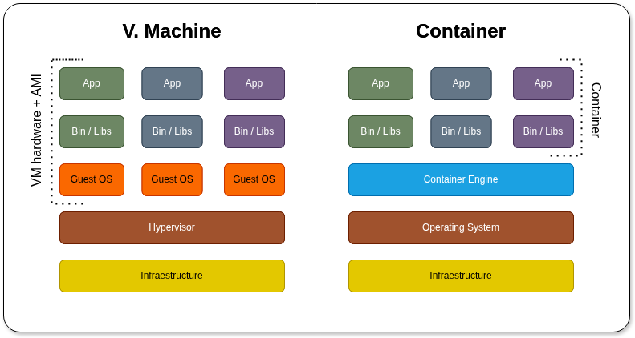

# 📦 Historia y fundamentos de los contenedores  

---  

## 1️⃣ ¿Qué son los contenedores?  

- **Unidad de software** que empaqueta una aplicación + todas sus dependencias.  
- Se ejecutan en un entorno aislado pero comparten el *kernel* del SO host.  
- Ventajas:  
  - Portabilidad (mismo comportamiento en dev, test, prod).  
  - Escalabilidad rápida y eficiente.  
  - Uso mínimo de recursos – “ligero” frente a VMs.  

Fuente: https://www.youtube.com/watch?v=Nm1tfmZDqo8

---  

## 2️⃣ Breve historia  
| Año | Evento |
|-----|--------|
| **2008** | LXC (Linux Containers) surge como primera tecnología de contenedores en Linux. |
| **2013** | Docker, Inc. lanza Docker → populariza la creación y distribución de contenedores. |
| **2015** | Se crea OCI (Open Container Initiative) para estandarizar formatos e interoperabilidad. |

---  

## 3️⃣ Contenedores vs. Máquinas Virtuales  
| Característica                 | VM                 | Contenedor                   |
| ------------------------------ | ------------------ | ---------------------------- |
| Emulación de hardware completo | ✔️                 | ❌                            |
| Sistema operativo propio       | ✔️ (cada VM)       | ❌ (comparten kernel)         |
| Aislamiento a nivel de OS      | Sí, con hipervisor | Sí, con namespaces & cgroups |
| Peso/Overhead                  | Alto               | Bajo                         |
| Tiempo de arranque             | Minutos            | Segundos                     |
| Uso de recursos                | Mayor              | Menor                        |

---  

## 4️⃣ Estándares clave: OCI  

La OCI (Open Container Initiative) un proyecto de código abierto bajo la Linux Foundation.

El objetivo de la OCI es establecer **estándares abiertos, neutrales y portables** para las tecnologías de contenedores de software, asegurando que las imágenes y los tiempos de ejecución sean compatibles y funcionen igual independientemente del proveedor o la plataforma que se utilice (Docker, Podman, CRI-O, etc.).

- **Open Container Initiative** (2015) – coalición Docker, Google, Red Hat, VMware, CoreOS.  
- Define:  
  - Formato de imagen (`oci-image-spec`).  
  - Entorno de ejecución (`runtime-spec`).  
- Beneficios:  
  - Portabilidad entre runtimes y proveedores cloud.  
  - Confianza en la consistencia del despliegue.  

---  

## 5️⃣ Casos de uso más comunes  
| Área | Descripción |
|------|-------------|
| **Desarrollo & pruebas** | Entornos reproducibles, “build once run anywhere”. |
| **Microservicios** | Cada servicio aislado y escalable independientemente. |
| **CI/CD pipelines** | Builds, tests, deploys en contenedores. |
| **Aislamiento de aplicaciones** | Seguridad y estabilidad entre procesos. |
| **Escalabilidad & alta disponibilidad** | Replicación automática con orquestadores (K8s, Docker Swarm). |
| **Desarrollo multiplataforma** | Aplicaciones web, APIs, back‑ends, bases de datos, jobs batch. |

> ⚠️ *Excepción:* aplicaciones móviles requieren frameworks específicos y no se despliegan como contenedores.

---  

## 6️⃣ Resumen rápido  
- Los contenedores son la **tecnología ligera** que permite mover una app entre entornos sin sorpresas.  
- Docker popularizó su uso; OCI garantiza interoperabilidad.  
- Son ideales para *todo* tipo de servicios backend, APIs y procesos automatizados, salvo apps móviles con interfaces nativas.

---  

 Fuente: https://pabpereza.dev/docs/cursos/docker/curso_de_docker_desde_cero