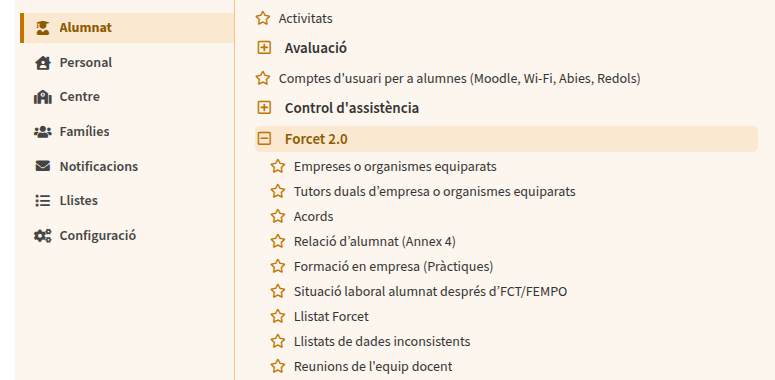

## 📝 Acta de Reunión de Equipo

| **Elemento** | **Detalle** |
| :--- | :--- |
| **Fecha** | Día, 27/10/2025 |
| **Hora de Inicio** | 14:00 |
| **Hora de Finalización** | 15:00 |
| **Lugar/Modalidad** | Saló d'actes |
| **Coordinador/Moderador** | Teresa Sanchez |
| **Encargado del Acta** | Martí Vich |

### 👥 Participantes

* [Nombre y Apellidos (Área/Rol)]
* [Nombre y Apellidos (Área/Rol)]
* [Nombre y Apellidos (Área/Rol)]
* [...añadir más si es necesario]

### 📃 Puntos de la Agenda

* Sin puntos iniciales

---

### 1. 🔄 Seguimiento de Acuerdos Anteriores

* Sin acuerdos anteriores

---

### 2. 🗣️ Desarrollo de los Puntos (Temas Tratados)

1. S'ha de fer un registre de tot el que feim. Aquest registre es du dins les carpetes del drive:
`Unitats compartides/FCT/Registres/GRAU/Curs/`
2. Si no hi ha acord amb les empreses s'ha de fer un de nou. Aquests acords estan al GESTIB (FORCET)

3. Classroom
- Tenim un full de càlcul que es diu `Contactes empreses`. Aquí tenim un llistat de les empreses on tenim aquelles que ens ha anat bé i aquelles que no. No és el mateix que el llistat al GESTIB.
4. Hem de confirmar que tenim accés al FORCET
5. Han de fer-se el NAF tots els alumnes
6. Hi ha un apartat al classroom, les dades que han d'enviar les empreses.

---

### 3. ✅ Acuerdos y Próximos Pasos (Acciones)

| **Acción Específica** | **Responsable** | **Fecha Límite** | **Observaciones** |
| :--- | :--- | :--- | :--- |
| Confirmar que tenim accés a Forcet | Tots | 17/11/2025 | Gestib |
| Revisar que tots el alumnes tinguin accés a la SS | Tots | 17/11/2025 |

---

### 4. 📌 Próxima Reunión

* **Fecha Propuesta:** 17/11/2025
* **Hora Propuesta:** 14:00
* **Temas a Considerar:** 